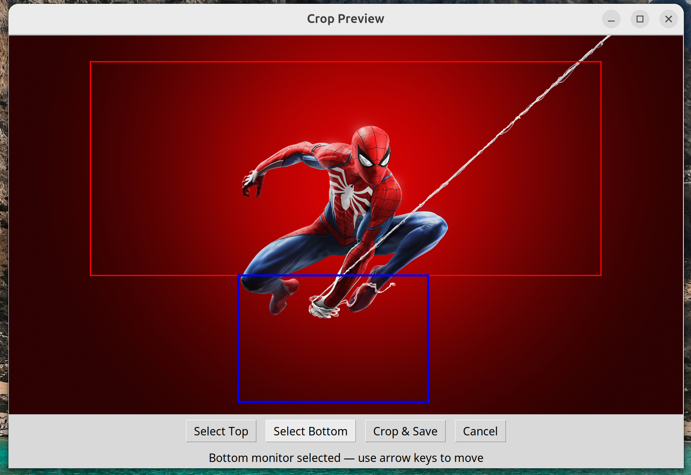

# Dual Wallpaper Cropper 🎨🖼️

**Dual Wallpaper Cropper** is a simple GUI tool for Linux that lets you crop a single image into perfectly aligned wallpapers for a dual-monitor layout.  
It ensures both monitors line up correctly by taking into account their **physical sizes** as well as their **resolutions**.

---

## ✨ Features
- T-shape (top + bottom)
- Side-by-side (left + right)
- Detects monitors automatically using `xrandr`
- Enter real diagonal sizes (inches) to account for DPI differences
- GUI preview of crop areas
- Move crop areas with **arrow keys**
- Separate crops for **top/left** and **bottom/right** monitor
- Saves wallpapers as `top_monitor.jpg` and `bottom_monitor.jpg`
- Error handling with GUI dialogs

---

## 📥 Installation

Clone the repo and install dependencies:

```bash
git clone https://github.com/yourusername/dual-wallpaper-cropper.git
cd dual-wallpaper-cropper
python3 -m venv venv
source venv/bin/activate
pip install -r requirements.txt
```

### 🖥️ System Requirements

This tool requires **Tkinter** (for the GUI) and `xrandr` (for monitor detection).

Install with:

```bash
sudo apt install python3-tk x11-xserver-utils
```

---

## 🚀 Usage

Run the app directly:

```bash
python -m wallpapercropper.app
```

Steps:
1. Select a wallpaper image  
2. Enter the diagonal size (inches) for each monitor  
3. Choose layout (**T-shape** or **Side-by-side**)  
4. Adjust crop areas in the preview:  
   - Use the buttons to select **Top/Left** or **Bottom/Right** monitor  
   - Use the **arrow keys** to move the crop box  
5. Save wallpapers — they will be exported as:  
   - `top_monitor.jpg`  
   - `bottom_monitor.jpg`  

---

## 🛠️ Building Executable

You can build a standalone binary with **PyInstaller**:

```bash
./build.sh
```

The binary will be in `dist/dual-wallpaper-cropper` and can run on any Ubuntu GNOME machine without Python installed.

Run it with:

```bash
./dist/dual-wallpaper-cropper
```

---

## 📸 Screenshots

_(Add screenshots of your app here)_

- Main preview window:  
  

- Cropped output example:  
  

---

## 📜 License

This project is licensed under the MIT License — see the [LICENSE](LICENSE) file for details.